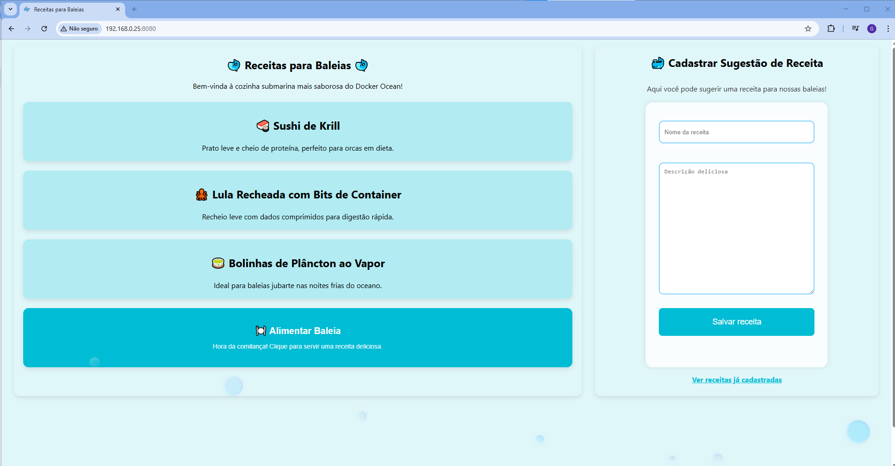
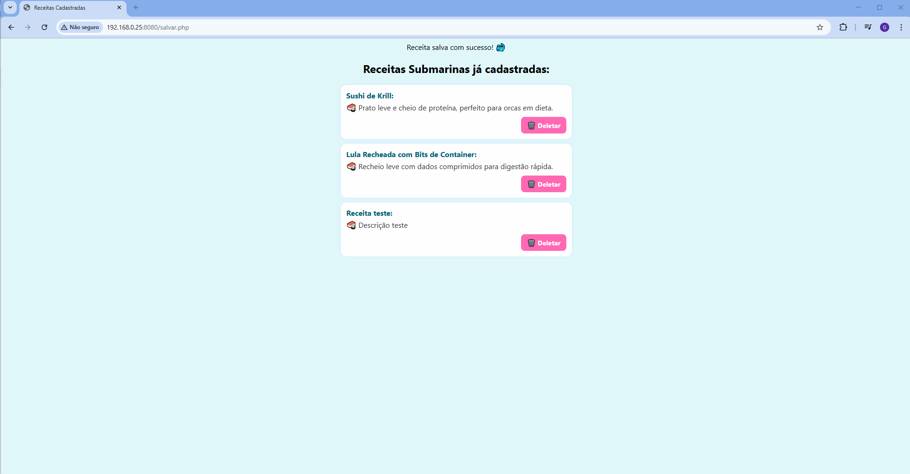

# 🐳 Receitas para Baleias

Bem-vinda(o) à cozinha submarina mais saborosa do Docker Ocean!  
Este é um projeto web feito com carinho, onde você pode visualizar, cadastrar e deletar receitas deliciosas pensadas especialmente para baleias!  

> 💡 Projeto desenvolvido como desafio de prática com Docker, PHP, MySQL e front-end responsivo.

---

## 🌐 Tecnologias Utilizadas

- HTML5 + CSS3 (layout responsivo e animado)
- PHP (backend simples com PDO)
- MySQL (armazenamento de receitas)
- Docker + Docker Compose (ambiente isolado e reproduzível)
- JavaScript (interações divertidas no botão da baleia 🐋)

---

## 📸 Capturas de Tela

| Página Principal | Página de Receitas |
|------------------|--------------------|
|  |  |


---

## 🚀 Como Rodar o Projeto

### Pré-requisitos

- [Docker](https://www.docker.com/) instalado na sua máquina

### Passo a Passo
> 💡 *Importante*: Certifique-se de que o Docker esteja rodando antes de executar os comandos!

1. Clone este repositório:
   ```bash
   git clone https://github.com/BrendaStreng/desafio-docker
   cd desafio-docker 

2. Suba os containers:

   ```bash
   docker-compose up --build
   ```

3. Acesse no navegador:
   
    ```bash
   http://localhost:8080

    ```
 Prontinho! O projeto estará rodando com o banco MySQL já configurado automaticamente via init.sql.


---

## 📂 Estrutura do Projeto
```
📁 projeto/
├── index.php
├── salvar.php
├── deletar.php
├── style.css
├── script.js
├── Dockerfile
├── docker-compose.yml
├── init.sql
└── prints/
    ├── home.png
    └── receitas.png

```
---  


## 🐳 Curiosidade

O projeto foi inspirado em uma brincadeira carinhosa com o mundo do Docker e oceanos.
As receitas submarinas são fictícias, mas o amor pelo código é real! 💻💕

---
